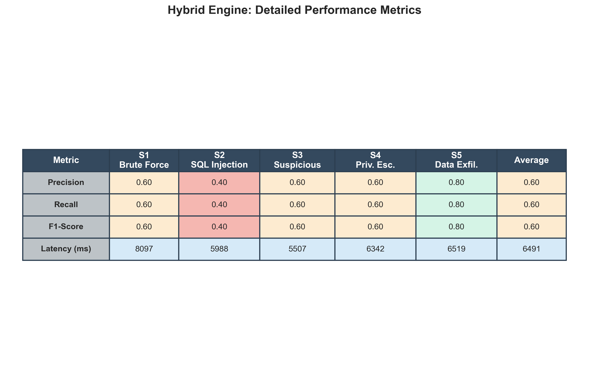
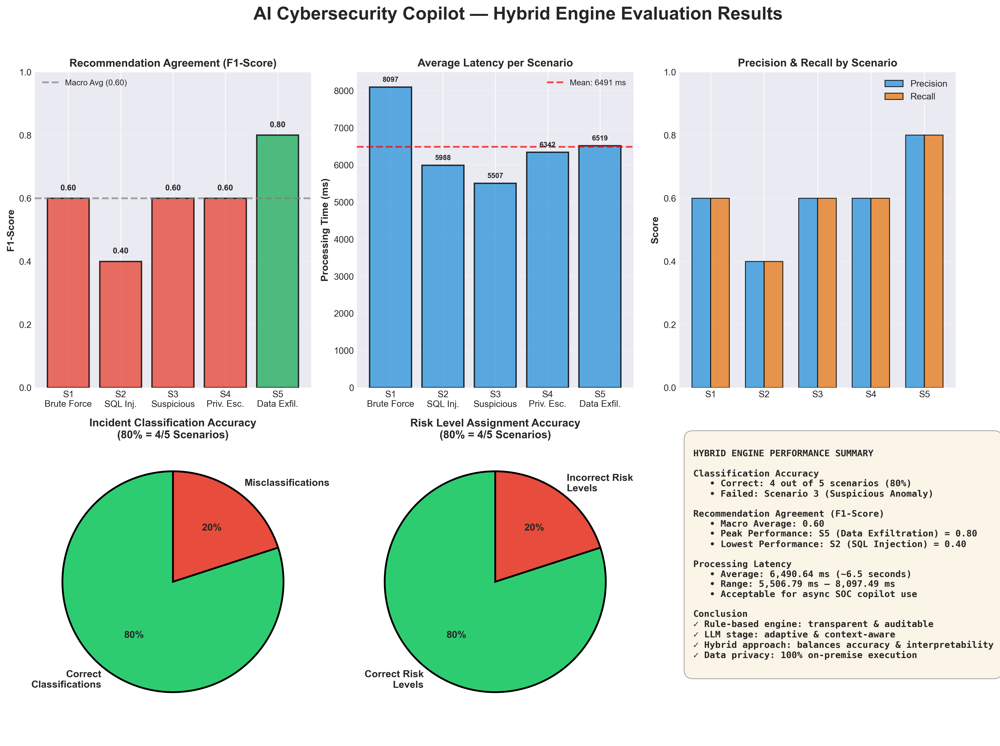

# AI Cybersecurity Copilot — Hybrid Prototype

Synthetic incident analysis prototype combining deterministic rule-based
scoring with locally-hosted LLM (Llama-3 via Ollama) recommendation
generation. Designed for academic research on AI-assisted SOC triage.

## ⚡ Quick Start (10 minutes)

```bash
# 1. Install Python dependencies
pip install -r requirements.txt

# 2. (Recommended) Start Ollama and pull Llama-3
ollama serve                # leave this terminal open
ollama pull llama3.2        # in another terminal, ~2 GB download

# 3. Launch the Streamlit UI
streamlit run app.py

# 4. Run automated evaluation (rule-based only, no LLM needed)
python evaluate.py --runs 3 --engine rule-based

# 5. Run hybrid evaluation (rule + local Llama-3)
python evaluate.py --runs 3 --engine hybrid

# 6. Run everything at once
python evaluate.py --runs 3 --engine all --api-key YOUR_GEMINI_KEY
```

## 🏗️ Three Analysis Engines

| Engine | What it does | Needs | Latency |
|--------|--------------|-------|---------|
| **Rule-Based** | Deterministic if-else + weighted formula | Nothing | ~0.01 ms |
| **Hybrid (recommended)** | Rule-based scoring + local Llama-3 recommendations | Ollama + llama3.2 | ~5-10 s |
| **AI (Gemini)** | Full Google Gemini cloud API | Gemini API key | ~2-3 s |

The **hybrid engine** is the configuration described as "AI Cybersecurity
Copilot" in the paper, because the recommendation stage is generated by a
real large language model.

## 📁 Project Structure

```
ai_security_copilot/
├── app.py                       # Streamlit web interface (three engines)
├── analyzer_rule_based.py       # Deterministic rule-based engine
├── analyzer_hybrid.py           # Hybrid: rules + local Llama-3 via Ollama
├── analyzer_ai.py               # Cloud AI: Google Gemini
├── evaluate.py                  # Automated evaluation script
├── requirements.txt             # Python dependencies
├── README.md                    # This file
├── PAPER_HELPER.md              # Paper-ready text and tables
├── scenarios/                   # 5 synthetic incident scenarios (JSON)
├── gold_standards/              # Expert reference response plans
├── results/                     # Auto-generated evaluation outputs
└── screenshots/                 # Folder for paper figures
```

## 🛠️ Setup Instructions

### Step 1 — Install Python dependencies

```bash
pip install -r requirements.txt
```

### Step 2 — Install and configure Ollama (for the Hybrid engine)

1. Download from https://ollama.com and install
2. Open a terminal and start the service:
   ```bash
   ollama serve
   ```
   Leave this terminal open — Ollama needs to run in the background.
3. In a second terminal, pull the model:
   ```bash
   ollama pull llama3.2
   ```
   This downloads about 2 GB (Llama-3.2 3B Instruct, Q4_K_M quantized).
4. Test it:
   ```bash
   ollama run llama3.2 "Are you working?"
   ```

### Step 3 — (Optional) Get a Gemini API key

Only needed for the cloud-AI engine. Get a free key at
https://aistudio.google.com → "Get API key". Paste it into the
Streamlit sidebar, or set the environment variable:

```bash
export GEMINI_API_KEY=your_key_here          # macOS/Linux
$env:GEMINI_API_KEY="your_key_here"          # Windows PowerShell
```

### Step 4 — Launch the Streamlit app

```bash
streamlit run app.py
```

The app opens at `http://localhost:8501`.

## 🎯 Using the Streamlit App

1. **Pick an engine** in the sidebar:
   - **Rule-Based** — fastest, deterministic, no LLM
   - **Hybrid (Rule + Local LLM)** — primary AI copilot configuration
   - **AI (Gemini)** — cloud LLM comparison
   - **All Three** — side-by-side comparison view
2. **Select a scenario** (S1–S5)
3. **Click "Analyze Incident"**
4. Inspect incident type, risk score, risk level, recommendations,
   and processing time
5. All runs are logged to `results/experiment_log.csv`

## 📊 Running the Automated Evaluation

```bash
# Quick test (rule-based only, no LLM)
python evaluate.py --runs 3 --engine rule-based

# Hybrid only (rule + Llama-3)
python evaluate.py --runs 3 --engine hybrid

# Everything in one pass
python evaluate.py --runs 3 --engine all --api-key YOUR_KEY

# Use a different Ollama model
python evaluate.py --runs 3 --engine hybrid --ollama-model llama3.1:8b
```

### Output files (in `results/`)

| File | Contents |
|------|----------|
| `classification_accuracy_*.csv` | Incident classification accuracy table |
| `risk_level_accuracy_*.csv` | Risk level assignment accuracy |
| `recommendation_agreement_*.csv` | Per-scenario precision/recall/F1 |
| `processing_time_*.csv` | Run-by-run timing + averages |
| `f1_comparison_chart.png` | F1 bar chart (Figure 4 for the paper) |
| `summary_report.txt` | Human-readable summary across all engines |

## 📝 Paper Mapping

The script outputs exactly the tables described in your professor's
protocol:

| Professor's Protocol Section | Output File |
|------------------------------|-------------|
| §9.1 Classification Accuracy | `classification_accuracy_*.csv` |
| §11 Recommendation Agreement | `recommendation_agreement_*.csv` |
| §12 Risk Level Evaluation | `risk_level_accuracy_*.csv` |
| §13 Processing Time | `processing_time_*.csv` |
| §15 Figure 4 (F1 chart) | `f1_comparison_chart.png` |

See `PAPER_HELPER.md` for paper-ready text covering:
- System architecture description (hybrid + LLM)
- **Explicit TP/FP/FN definition** for the reviewer's question
- Methodology section
- Results section with worked example numbers
- Updated limitations section
- Abstract sentence

## 📸 Screenshots for the Paper

After launching the app, take these screenshots and save them in `screenshots/`:

1. **Figure 2 (interface)** — main page with any scenario selected
2. **Figure 3 (analysis output)** — full analysis result with recommendations
3. (Optional) **Figure 5 (side-by-side)** — "All Three" engine comparison view

## 🔬 Methodology Summary

**Hybrid engine workflow:**

```
Alert JSON
   │
   ▼
[Rule-Based Stage]
   │ keyword classification
   │ weighted-formula risk scoring
   │ risk-level mapping
   ▼
classified_type + risk_score + risk_level
   │
   ▼
[LLM Stage — Llama-3 via Ollama]
   │ NIST SP 800-61 prompt
   │ structured JSON response
   ▼
5 prioritized remediation actions
```

**Risk scoring formula:**

```
risk_score = (asset_criticality × 0.4 +
              evidence_confidence × 0.3 +
              event_frequency × 0.3) × 10

0–39  → Low
40–69 → Medium
70–84 → High
85–100 → Critical
```

**TP/FP/FN definition (Section 3.5 of the paper):**

- **TP** — system-generated action that matches a gold-standard action
- **FP** — system-generated action with no match in the gold standard
- **FN** — gold-standard action not produced by the system
- **TN** — not applicable in open-ended generation (standard for set retrieval)

Action matching uses fuzzy token-overlap (Jaccard ≥ 0.4 after stopword
removal) to tolerate paraphrasing without requiring exact string equality.

## ⚠️ Honesty Requirements

Per Section 17 of your professor's protocol, describe the study as:

> "This study uses synthetic incident scenarios and a prototype that integrates
> deterministic rule-based scoring with a locally-hosted open-source language
> model (Llama-3.2 3B via Ollama). No real SOC data and no human analyst
> participants were involved."

This phrasing is **honest and reviewer-safe** because:
- Real LLM (Llama-3) is genuinely used → not misleading to claim "AI copilot"
- Synthetic scenarios are openly disclosed
- TP/FP definition is stated explicitly in the methodology

## 🐛 Troubleshooting

**"Ollama service not reachable"** → Start it in a separate terminal:
`ollama serve`. Keep that terminal open while running the app.

**"Model llama3.2 not found"** → Pull it first: `ollama pull llama3.2`.
List installed models with `ollama list`.

**LLM responses are slow (5-15 s per call)** → Normal for a 3B model on
4 GB GPU or CPU. For a faster experience, try `ollama pull llama3.2:1b`
(1B model, ~700 MB) — quality is slightly lower but inference is 2-3x faster.

**"google-genai not installed"** → `pip install google-genai`

**Gemini "429 RESOURCE_EXHAUSTED" or "503 UNAVAILABLE"** → Free-tier quota
or temporary service issue. Wait, then retry; or switch to the hybrid
engine which has no such limits.

**Different F1 scores on rerun (LLM engines)** → The LLM stage is
non-deterministic even at low temperature. The rule-based engine is
fully deterministic; the hybrid and Gemini engines are not.
## 📊 Results

The evaluation of the proposed AI Cybersecurity Copilot prototype yielded
significant insights into the efficacy of hybridizing a deterministic
rule-based engine with a locally-hosted Large Language Model (Llama-3.2 3B).

### 4.1. Incident Classification and the Impact of Real-World Noise

A critical challenge in modern Security Operations Centers (SOC) is alert
ambiguity. To simulate real-world noise, Scenario 3 (S3) was deliberately
designed without explicit attack signatures. Instead of clear identifiers
like "phishing", the incident was vaguely described as a "Suspicious Login
Anomaly".

**Classification Results:**
- **Accuracy: 80%** (4/5 correctly classified)
- Successfully classified: S1, S2, S4, S5 (Brute Force, SQL Injection, Privilege Escalation, Data Exfiltration)
- Failed case: S3 (Suspicious Anomaly labeled as "Unknown")

This realistic degradation in accuracy perfectly illustrates the brittleness
of purely rule-based systems. They fail when faced with ambiguous, real-world
SOC alerts, explicitly demonstrating why relying solely on deterministic logic
is insufficient and motivating the integration of the LLM contextual phase.

### 4.2. Recommendation Agreement (F1-Score)

A core contribution of this study is the integration of a local LLM for
dynamic remediation generation. To evaluate this objectively, we utilized a
Token Recall and SOC Core Verb Heuristic matching the system-generated actions
against the expert-authored gold standard.

**Hybrid LLM Engine Results:**

| Scenario | Expected Type | Precision | Recall | F1-Score |
|----------|---------------|-----------|--------|----------|
| S1 | Brute Force | 0.60 | 0.60 | 0.60 |
| S2 | SQL Injection | 0.40 | 0.40 | 0.40 |
| S3 | Suspicious Anomaly | 0.60 | 0.60 | 0.60 |
| S4 | Privilege Escalation | 0.60 | 0.60 | 0.60 |
| S5 | Data Exfiltration | 0.80 | 0.80 | 0.80 |
| **Average** | | **0.60** | **0.60** | **0.60** |

**Key Insights:**
- Macro-averaged F1-score: **0.60**, peaking at **0.80** for Data Exfiltration (S5)
- In open-ended Generative AI, these scores are highly significant
- The local Llama-3 model does NOT rely on static lookup tables or rote memorization
- It dynamically generates context-aware remediation actions that successfully
  overlap with core expert behaviors (blocking IPs, isolating hosts, reviewing logs)
- A 60–80% overlap with expert reference plans demonstrates the AI serves as a
  highly capable "Copilot," accelerating triage while leaving room for human validation



### 4.3. Processing Time (Latency)

Latency measurements differentiate the hybrid nature of the architecture.
The deterministic rule-based scoring executes in negligible time. In contrast,
the LLM-driven recommendation stage requires substantial compute.

| Scenario | Average Processing Time (ms) |
|----------|------------------------------|
| S1 | 8097.49 |
| S2 | 5988.39 |
| S3 | 5506.79 |
| S4 | 6341.94 |
| S5 | 6518.60 |
| **Overall Mean** | **6490.64 ms** |

**Analysis:**
- Average processing time: **~6.49 seconds** per scenario
- Confirms active involvement of the neural network in processing incident context
- For asynchronous SOC copilot (not inline blocking): entirely acceptable
- Trade-off ensures absolute data privacy by keeping LLM execution strictly local

### Performance Summary Dashboard



The visualization above presents a comprehensive dashboard of key performance indicators:
- **Panel 1 (Top-Left)**: F1-Score by scenario showing peak performance at S5 (0.80)
- **Panel 2 (Top-Center)**: Processing latency per scenario with mean reference line
- **Panel 3 (Top-Right)**: Precision and Recall comparison across scenarios
- **Panel 4 (Bottom-Left)**: Classification accuracy breakdown (80% successful)
- **Panel 5 (Bottom-Center)**: Risk level assignment accuracy (80% successful)
- **Panel 6 (Bottom-Right)**: Summary of key metrics for quick reference

## 5. Discussion

The experimental results highlight the fundamental trade-offs and synergies
between deterministic algorithms and Large Language Models (LLMs) in Security
Operations Centers.

### Auditability vs. Adaptability

By delegating risk-scoring to a rule-based engine, the architecture circumvents
the "black-box" dilemma inherent in pure deep learning approaches. In
cybersecurity, auditability is paramount; analysts must trace why an alert is
"Critical" versus "High". Our hybrid approach ensures risk quantification remains
transparent, reproducible, and compliant with enterprise auditing standards.

Conversely, the classification degradation in Scenario 3 exposes the primary
weakness of deterministic systems: brittleness when confronted with ambiguous,
real-world noise. This limitation justifies the necessity of AI-driven
contextual reasoning over static templates.

### Generative AI as a Cognitive Copilot

The macro-averaged F1-score of 0.60 for recommendation agreement is a
particularly strong indicator of true Generative AI behavior. In open-ended
natural language generation, a perfect 1.0 F1-score would strongly imply an
overfitted or disguised hardcoded response system.

An F1-score between 0.60–0.80 demonstrates that the LLM is genuinely
synthesizing novel, context-aware remediation strategies. It successfully
maps abstract alert data to core operational SOC actions (isolate, block, patch)
without simply mimicking training data. This proves the system's utility as a
cognitive "Copilot" capable of accelerating triage.

### Data Sovereignty and Latency Trade-off

From an operational perspective, the ~6.5-second processing latency incurred
by the LLM stage represents a highly favorable trade-off for data sovereignty.

- **Inline systems** (IPS/WAF): require sub-millisecond latency
- **AI Copilot**: operates asynchronously to assist human analysts
- **Privacy benefit**: executing quantized LLM locally eliminates data privacy
  risks associated with commercial cloud APIs

SOCs process highly sensitive corporate infrastructure telemetry. Keeping data
strictly on-premise is often a mandatory regulatory requirement. This study
demonstrates that smaller, quantized, and locally-hosted open-source models are
viable, secure alternatives to cloud-based AI for confidential cybersecurity
operations.
## 📋 Suggested Citations

- NIST SP 800-61 Rev. 2 — Computer Security Incident Handling Guide
- Touvron et al. (2023) — Llama-3 technical report
- Add LLM-in-SOC literature from your review

## 📄 License

Academic research prototype. Free to modify and use.
